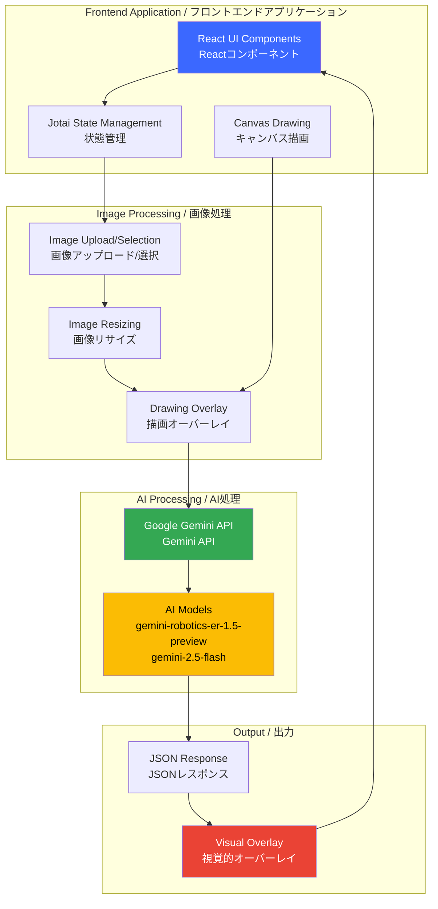
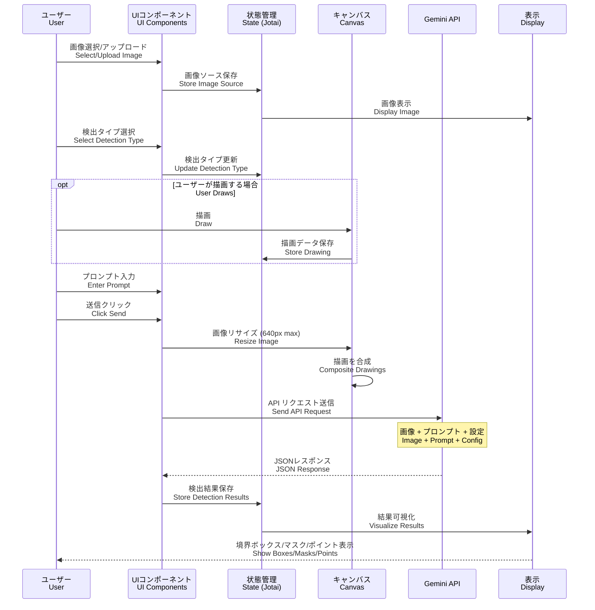
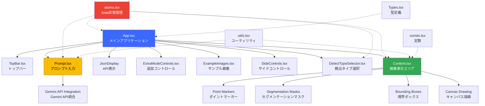
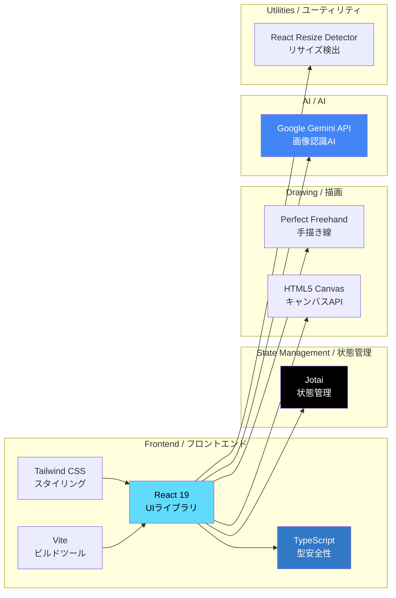
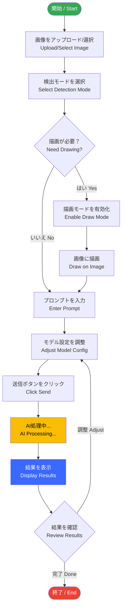

<div align="center">

</div>

# Robotics Spatial Understanding / ロボット空間認識

An interactive demo application showcasing how Google's Gemini AI provides robots with critical spatial understanding capabilities through advanced computer vision.

インタラクティブなデモアプリケーション。Google Gemini AIがロボットに高度なコンピュータビジョンを通じて重要な空間認識機能を提供する様子を紹介します。

View your app in AI Studio: https://ai.studio/apps/drive/1DQHJ-JXd7fBEjbh1EAmshh_jFUn1irbg

---

## 📋 目次 / Table of Contents

- [概要 / Overview](#-概要--overview)
- [主な機能 / Features](#-主な機能--features)
- [アーキテクチャ / Architecture](#-アーキテクチャ--architecture)
- [データフロー / Data Flow](#-データフロー--data-flow)
- [コンポーネント構成 / Component Structure](#-コンポーネント構成--component-structure)
- [技術スタック / Technology Stack](#-技術スタック--technology-stack)
- [セットアップ / Setup](#-セットアップ--setup)
- [使い方 / Usage](#-使い方--usage)

---

## 🌟 概要 / Overview

This application demonstrates the power of Gemini AI in understanding spatial relationships and objects within images. It provides five distinct detection modes that can be used for robotics applications, inventory management, accessibility features, and more.

このアプリケーションは、画像内の空間的関係やオブジェクトを理解するGemini AIの力を実証します。ロボティクスアプリケーション、在庫管理、アクセシビリティ機能などに使用できる5つの異なる検出モードを提供します。

---

## ✨ 主な機能 / Features

### 1. 2D Bounding Boxes / 2D境界ボックス
Detect and label objects with rectangular bounding boxes.
オブジェクトを矩形の境界ボックスで検出およびラベル付けします。

### 2. Segmentation Masks / セグメンテーションマスク
Perform pixel-level segmentation of objects in images.
画像内のオブジェクトをピクセルレベルでセグメント化します。

### 3. Points / ポイント
Identify specific points of interest within images.
画像内の特定の関心点を識別します。

### 4. Price Prediction / 価格予測
Detect items and estimate their market prices in Japanese Yen (JPY).
アイテムを検出し、日本円（JPY）での市場価格を推定します。

### 5. Text Extraction / テキスト抽出
Extract and transcribe all visible text from images.
画像から表示されているすべてのテキストを抽出および転写します。

---

## 🏗️ アーキテクチャ / Architecture



---

## 🔄 データフロー / Data Flow



---

## 🧩 コンポーネント構成 / Component Structure



### 主要コンポーネントの説明 / Key Component Descriptions

#### App.tsx
メインアプリケーションコンポーネント。レイアウトと主要コンポーネントを統合します。
Main application component that integrates layout and primary components.

#### Content.tsx
画像表示とインタラクティブな描画機能を提供します。検出結果をオーバーレイ表示します。
Provides image display and interactive drawing functionality. Overlays detection results.

#### Prompt.tsx
ユーザー入力、モデル選択、API通信を管理します。
Manages user input, model selection, and API communication.

#### DetectTypeSelector.tsx
5つの検出モード間の切り替えを提供します。
Provides switching between five detection modes.

#### atoms.tsx
Jotaiを使用したグローバル状態管理。
Global state management using Jotai.

---

## 💻 技術スタック / Technology Stack



### Dependencies / 依存関係

- **React 19**: Modern UI library
- **TypeScript 5.8**: Type safety and better developer experience
- **Vite 6**: Lightning-fast build tool
- **Jotai 2.10**: Primitive and flexible state management
- **@google/genai 0.7**: Google Gemini AI SDK
- **Tailwind CSS 4**: Utility-first CSS framework
- **Perfect Freehand 1.2**: Draw perfect freehand lines
- **React Resize Detector 12**: Detect element resize

---

## 🚀 セットアップ / Setup

### Prerequisites / 前提条件

- **Node.js** (v18 or higher / v18以上)
- **npm** or **yarn**
- **Google Gemini API Key** / Gemini APIキー

### Installation / インストール

1. **Clone the repository / リポジトリをクローン**
   ```bash
   git clone https://github.com/kenichimiyata/pricecheck.git
   cd pricecheck
   ```

2. **Install dependencies / 依存関係をインストール**
   ```bash
   npm install
   ```

3. **Set up environment variables / 環境変数を設定**
   
   Create a `.env.local` file in the root directory:
   
   `.env.local`ファイルをルートディレクトリに作成:
   ```bash
   GEMINI_API_KEY=your_api_key_here
   ```

4. **Run the development server / 開発サーバーを起動**
   ```bash
   npm run dev
   ```

5. **Open in browser / ブラウザで開く**
   ```
   http://localhost:5173
   ```

### Build for Production / 本番用ビルド

```bash
npm run build
npm run preview
```

---

## 📖 使い方 / Usage

### Basic Workflow / 基本的なワークフロー



### Detection Modes / 検出モード

1. **2D Bounding Boxes**: General object detection
2. **Segmentation Masks**: Detailed object segmentation
3. **Points**: Specific point identification
4. **Price Prediction**: Object detection with price estimation
5. **Text Extraction**: OCR and text recognition

### Tips / ヒント

- **Temperature**: Lower values (0-0.5) for more precise results, higher values (0.6-1.0) for more creative outputs
  
  温度：より正確な結果には低い値（0〜0.5）、よりクリエイティブな出力には高い値（0.6〜1.0）

- **Thinking Mode**: Enable for complex reasoning tasks, disable for faster simple detection
  
  思考モード：複雑な推論タスクには有効化、より高速な単純検出には無効化

- **Drawing**: Use the draw mode to guide the AI by highlighting specific areas
  
  描画：描画モードを使用して、特定の領域を強調表示することでAIを誘導

---

## 📄 License / ライセンス

Copyright 2025 Google LLC

Licensed under the Apache License, Version 2.0

---

## 🤝 Contributing / 貢献

Contributions are welcome! Please feel free to submit a Pull Request.

貢献を歓迎します！お気軽にプルリクエストを提出してください。

---

## 📞 Support / サポート

For issues and questions, please use the GitHub Issues page.

問題や質問については、GitHub Issuesページをご利用ください。
